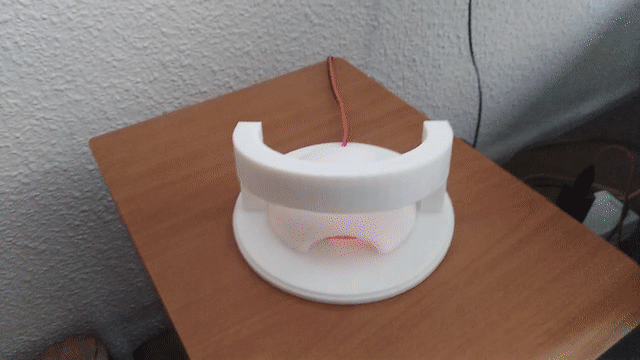
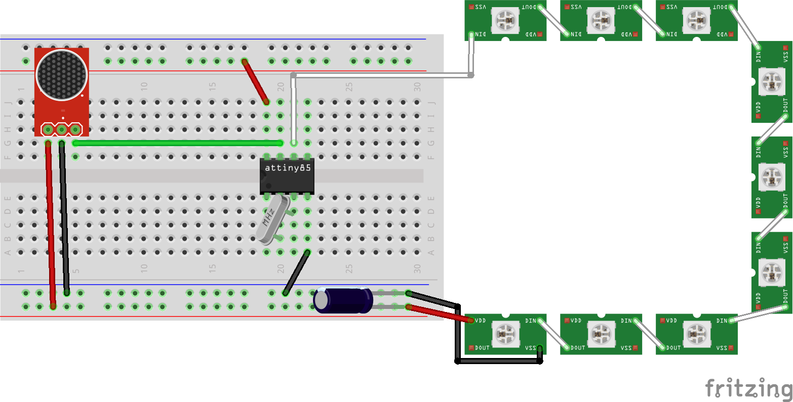

VULamp
==============

#### Part list

- [3D printed enclosure](enclosure/enclosure.stl)
- 9 WS2812B RGB leds (in a strip)
- 1 470μF electrolytic capacitor
- 1 MAX4466 electret mic amplifier module
- 1 Atmel ATtiny85
- 1 20mhz crystal
- 1 48mm² perfboard
- 1 USB type A male connector
- A bunch of 36 AWG wire

